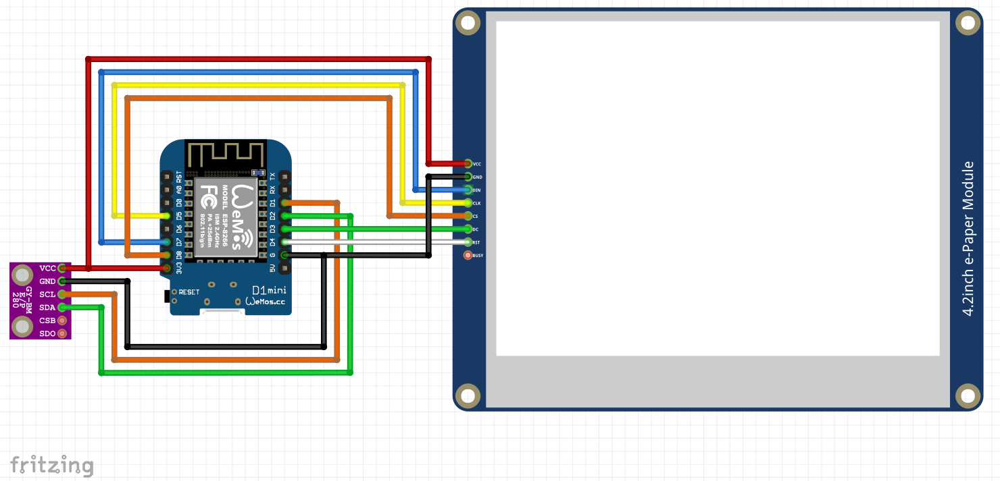

# legendary-dashboard

[](https://travis-ci.org/henrythasler/legendary-dashboard)

A legendary IoT monitoring station with e-Paper dashboard and anomaly-detection, NOT!

## Getting started

 1. [Download Visual Studio Code](https://code.visualstudio.com/Download), install and run.
 2. [Install PlatformIO IDE extension](https://platformio.org/install/ide?install=vscode) for Visual Studio Code.
 3. Clone this repo (`git clone https://github.com/henrythasler/legendary-dashboard.git`), open folder in Visual Studio Code.

## Hardware setup

### Preliminary Version



## Setting up a Raspberry Pi as PIO remote agent

> "[PIO Remote](https://docs.platformio.org/en/latest/plus/pio-remote.html) allows you to work remotely with devices from Anywhere In The World."

A Raspberry Pi with [raspbian-buster-lite](https://www.raspberrypi.org/downloads/raspbian/) can act as host for remote sessions to embedded devices connected via USB.

Install PIO remote agent:
```
$ sudo apt-get install python3-distutils python3-dev libffi-dev libssl-dev
$ curl -fsSL https://raw.githubusercontent.com/platformio/platformio-core-installer/master/get-platformio.py -o get-platformio.py
$ python3 get-platformio.py
```

add platformio binaries to path:
```
$ nano ~/.profile
    export PATH=$PATH:~/.platformio/penv/bin
$ source ~/.profile
```
Optional: set up [udev-rules](https://docs.platformio.org/en/latest/faq.html#platformio-udev-rules)

Log-in and run agent:

```
$ platformio account login -u USER -p PASS
$ platformio remote agent start
```

Run in background:
```
$ platformio remote agent start 2>&1 >/dev/null &
```

## References

### BME280 Environmental sensor

 - [Datasheet (PDF)](https://cdn-shop.adafruit.com/datasheets/BST-BME280_DS001-10.pdf)
 - [Create A Simple ESP8266 Weather Station With BME280](https://lastminuteengineers.com/bme280-esp8266-weather-station/)
 - [Adafruit BME280 Humidity + Barometric Pressure + Temperature Sensor Breakout](https://learn.adafruit.com/adafruit-bme280-humidity-barometric-pressure-temperature-sensor-breakout/arduino-test)

