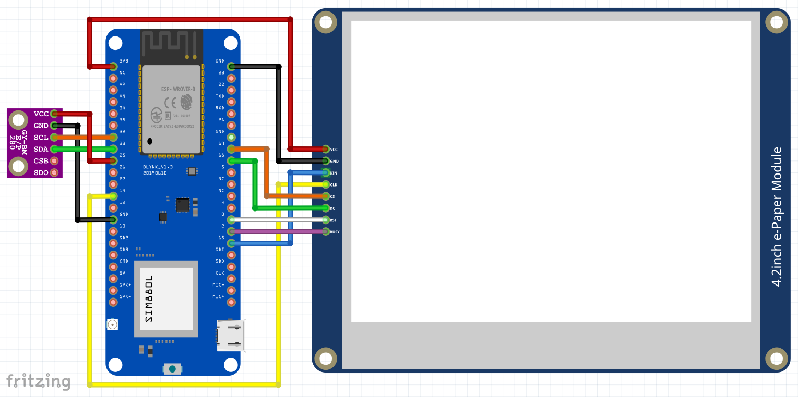

# legendary-dashboard

[](https://travis-ci.org/henrythasler/legendary-dashboard)

A legendary IoT monitoring station with e-Paper dashboard and anomaly-detection, NOT!

## Getting started

 1. [Download Visual Studio Code](https://code.visualstudio.com/Download), install and run.
 2. [Install PlatformIO IDE extension](https://platformio.org/install/ide?install=vscode) for Visual Studio Code.
 3. Clone this repo (`git clone https://github.com/henrythasler/legendary-dashboard.git`), open folder in Visual Studio Code.

To enable token authentication for [PIO Remote](https://docs.platformio.org/en/latest/plus/pio-remote.html), the environment variable [PLATFORMIO_AUTH_TOKEN](https://docs.platformio.org/en/latest/envvars.html?utm_medium=piohome&utm_source=platformio#envvar-PLATFORMIO_AUTH_TOKEN) must be set before launching Visual Studio Code:

```
$ PLATFORMIO_AUTH_TOKEN=yourtokenhere code
```

Please check out [the tutorial](TUTORIAL.md) for more detailled instructions.

## Hardware setup

### Parts

- [SIM800L T-Call V1.3 ESP32](https://www.ebay.de/itm/SIM800L-T-Call-V1-3-ESP32-WLAN-Bluetooth-Funkmodul-GPRS-Antenne-SIM-Karte/143610289741)
- [Waveshare 4.2" 400×300 ePaper Display](https://www.berrybase.de/raspberry-pi-co/raspberry-pi/displays/4.2-400-215-300-epaper-display-modul-mit-spi-interface-dreifarbig-40-gelb-schwarz-wei-223?c=320&px=m)
- [BME280 Breakout Board](https://www.berrybase.de/bauelemente/sensoren-module/feuchtigkeit/bme280-breakout-board-3in1-sensor-f-252-r-temperatur-luftfeuchtigkeit-und-luftdruck)

### Wire Diagram



## Setting up a Raspberry Pi as PIO remote agent

> "[PIO Remote](https://docs.platformio.org/en/latest/plus/pio-remote.html) allows you to work remotely with devices from Anywhere In The World."

A Raspberry Pi with [raspbian-buster-lite](https://www.raspberrypi.org/downloads/raspbian/) can act as host for remote sessions to embedded devices connected via USB.

Install PIO remote agent:
```
$ sudo apt-get install python3-distutils python3-dev libffi-dev libssl-dev
$ curl -fsSL https://raw.githubusercontent.com/platformio/platformio-core-installer/master/get-platformio.py -o get-platformio.py
$ python3 get-platformio.py
```

add platformio binaries to path:
```
$ nano ~/.profile
    export PATH=$PATH:~/.platformio/penv/bin
$ source ~/.profile
```
Optional: set up [udev-rules](https://docs.platformio.org/en/latest/faq.html#platformio-udev-rules)

Log-in and run agent:

```
$ platformio account login -u USER -p PASS
$ platformio remote agent start
```

Run agent with [PLATFORMIO_AUTH_TOKEN](https://docs.platformio.org/en/latest/envvars.html?utm_medium=piohome&utm_source=platformio#envvar-PLATFORMIO_AUTH_TOKEN):

```
$ PLATFORMIO_AUTH_TOKEN=yourtoken platformio remote agent start
```

Run in background:
```
$ platformio remote agent start 2>&1 >/dev/null &
```

## Image conversion

- go to [image2cpp](http://javl.github.io/image2cpp/)
- upload an image
- Background color: `White`
- Brightness / alpha threshold: *as needed*
- Code output format: `Arduino Code`
- Draw mode: `Horizontal - 1 bit per pixel`
- Press: `Generate code`
- copy the generated code into your project

## References

### ESP32

 - [ESP32 Pinout Reference](https://randomnerdtutorials.com/esp32-pinout-reference-gpios/)
 - [ESP-IDF Programming Guide](https://docs.espressif.com/projects/esp-idf/en/latest/esp32/index.html)

### SIM800L T-Call V1.3 ESP32

 - [LilyGo T-Call SIM800L](https://github.com/Xinyuan-LilyGO/LilyGo-T-Call-SIM800L)
 - [Pinout - LilyGo T-Call SIM800L](https://raw.githubusercontent.com/Xinyuan-LilyGO/LilyGo-T-Call-SIM800L/master/image/SIM800L_IP.jpg)
 - [ESP32 Publish Data to Cloud without Wi-Fi](https://randomnerdtutorials.com/esp32-sim800l-publish-data-to-cloud/)
 
### Modem, GSM, Mobile Network

- [Using SIM7020E to Connect to 1NCE NB-IoT Network](https://www.hackster.io/hhf/using-sim7020e-to-connect-to-1nce-nb-iot-network-bfd41a)
- [Sim800L time not updating to network time](https://stackoverflow.com/questions/55023587/sim800l-time-not-updating-to-network-time)
- [SIM800L Modul Uhrzeit abfragen](https://www.mikrocontroller.net/topic/465585)

### BME280 Environmental sensor

 - [Datasheet (PDF)](https://cdn-shop.adafruit.com/datasheets/BST-BME280_DS001-10.pdf)
 - [Create A Simple ESP8266 Weather Station With BME280](https://lastminuteengineers.com/bme280-esp8266-weather-station/)
 - [Adafruit BME280 Humidity + Barometric Pressure + Temperature Sensor Breakout](https://learn.adafruit.com/adafruit-bme280-humidity-barometric-pressure-temperature-sensor-breakout/arduino-test)
 - [ESP32 I2C Communication](https://randomnerdtutorials.com/esp32-i2c-communication-arduino-ide/)

### Waveshare ePaper Display

 - [Waveshare 4.2inch e-Paper Module](https://www.waveshare.com/product/4.2inch-e-paper-module-b.htm)
 - [GxEPD E-Paper display library](https://github.com/ZinggJM/GxEPD)
 - [image2cpp](http://javl.github.io/image2cpp/)

### Raspberry Pi

- [Video Streaming with Raspberry Pi Camera](https://randomnerdtutorials.com/video-streaming-with-raspberry-pi-camera/)

### C++, Coding

- [Ramer-Douglas-Peucker line simplification](https://rosettacode.org/wiki/Ramer-Douglas-Peucker_line_simplification#C.2B.2B)
- [Robust endianness conversion](https://mklimenko.github.io/english/2018/08/22/robust-endian-swap/)
- [Overloading operators in typedef structs (c++)](https://stackoverflow.com/questions/14047191/overloading-operators-in-typedef-structs-c)
- [Gaussian Filter generation using C/C++](https://www.programming-techniques.com/2013/02/gaussian-filter-generation-using-cc.html)

### Artwork

- [Emir Haveric BMW X2 Campaign](https://www.kleinphotographen.com/news/emir-haveric-bmw-x2-campaign/1383)

### Custom Fonts

- [Online Font creator page](http://oleddisplay.squix.ch/#/home)
- [Adafruit GFX Graphics Library - Using Fonts](https://learn.adafruit.com/adafruit-gfx-graphics-library/using-fonts)